# BAB III
# METODOLOGI

## 3.1 Analisis Sistem

Penelitian ini menggunakan pendekatan **System Development Life Cycle (SDLC)** dengan model **Waterfall**. Model Waterfall dipilih karena kebutuhan sistem telah dapat didefinisikan secara jelas di awal, proses pengembangan bersifat linier dan terstruktur, serta setiap fase memiliki output yang terukur sebelum melanjutkan ke fase berikutnya. Hal ini sangat sesuai dengan karakteristik proyek capstone yang memiliki ruang lingkup dan batasan yang sudah terdefinisi dengan baik.

Model Waterfall pada proyek ini terdiri atas lima fase utama, yaitu:
1. **Requirements** (Analisis Kebutuhan)
2. **System Design** (Perancangan Sistem)
3. **Implementation** (Implementasi/Pengkodean)
4. **Verification** (Pengujian)
5. **Maintenance** (Pemeliharaan & Evaluasi)

Adapun kelebihan penggunaan model Waterfall dalam pengembangan Sistem Penjadwalan dan Rute Distribusi MBG ini antara lain:
- Proses pengembangan sistem lebih teratur dari tahap ke tahap.
- Setiap tahapan pengembangan sistem memiliki alur yang jelas.
- Memudahkan pengaturan waktu pengerjaan sistem.
- Proses dan hasil pengembangan sistem dapat didokumentasikan dengan baik.

---

## 3.2 Analisis Pengguna Sistem

Dalam sistem penjadwalan dan rute distribusi MBG yang dibangun, terdapat satu jenis pengguna utama yang memiliki peran dan hak akses sebagai berikut:

### Admin / Petugas Distribusi
Admin merupakan pengguna yang bertanggung jawab penuh dalam pengelolaan data dan pengoperasian sistem optimasi rute. Hak akses yang dimiliki antara lain:
- Login ke sistem
- Mengelola data Dapur MBG (menambah, mengedit, menghapus)
- Mengelola data Sekolah penerima MBG (menambah, mengedit, menghapus)
- Menjalankan proses optimasi rute distribusi
- Melihat hasil rute optimal pada peta interaktif
- Melihat riwayat hasil distribusi

---

## 3.3 Prosedur Sistem

Berikut merupakan prosedur utama dari Sistem Penjadwalan dan Rute Distribusi MBG:

### 1. Prosedur Login
Admin melakukan login dengan menginputkan username dan password pada halaman login untuk dapat mengakses seluruh fitur sistem.

### 2. Prosedur Kelola Data Dapur
Admin dapat menambah, mengedit, dan menghapus data Dapur MBG yang berisi nama dapur beserta koordinat lokasi (latitude & longitude) melalui antarmuka sistem.

### 3. Prosedur Kelola Data Sekolah
Admin dapat menambah, mengedit, dan menghapus data Sekolah penerima MBG yang berisi nama sekolah, koordinat lokasi, jumlah porsi MBG, serta dapur yang melayaninya.

### 4. Prosedur Optimasi Rute Distribusi
Admin memilih dapur asal dan sekolah-sekolah tujuan, kemudian sistem secara otomatis:
1. Mengunduh graf jaringan jalan raya menggunakan **OSMnx**
2. Menghitung jarak antar titik mengikuti jalan raya menggunakan **Algoritma Dijkstra**
3. Menentukan urutan kunjungan paling efisien menggunakan **Algoritma TSP (Travelling Salesman Problem)**
4. Menampilkan hasil rute optimal pada peta interaktif beserta total jarak tempuh

### 5. Prosedur Melihat Hasil Rute
Setelah proses optimasi selesai, sistem menampilkan hasil berupa peta interaktif dengan garis rute (*polyline*) dan tabel urutan kunjungan sekolah beserta estimasi jarak total.

### 6. Prosedur Logout
Admin keluar dari sistem sehingga sesi login berakhir dan sistem kembali ke halaman login.

---

## 3.4 Jadwal Pelaksanaan

| No | Kegiatan | Minggu 1 | Minggu 2 | Minggu 3 | Minggu 4 | Minggu 5 | Minggu 6 |
|----|----------|:--------:|:--------:|:--------:|:--------:|:--------:|:--------:|
| 1  | Analisis Kebutuhan | ✓ | | | | | |
| 2  | Perancangan Sistem (UML, ERD, UI) | ✓ | ✓ | | | | |
| 3  | Implementasi Backend (Python, API) | | ✓ | ✓ | | | |
| 4  | Implementasi Frontend (Web) | | | ✓ | ✓ | | |
| 5  | Pengujian & Debugging | | | | ✓ | ✓ | |
| 6  | Dokumentasi & Evaluasi | | | | | ✓ | ✓ |

---

## 3.5 Perancangan Sistem

Tahap perancangan sistem bertujuan untuk menerjemahkan hasil analisis kebutuhan ke dalam bentuk rancangan sistem. Pada tahap ini dilakukan perancangan menggunakan **UML (Unified Modeling Language)** serta perancangan antarmuka sistem (UI) sebagai alat bantu perancangan sistem.

---

## 3.6 Flowchart

Berikut merupakan alur sistem yang dibangun.

### 3.6.1 Flowchart Sistem

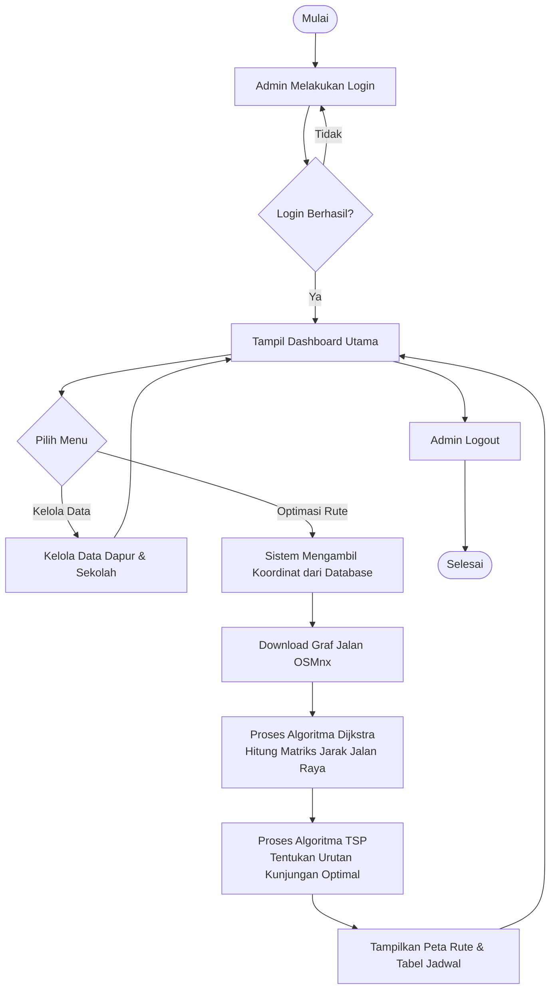

*Gambar 3.1 Flowchart Sistem*

### 3.6.2 Flowchart Algoritma Dijkstra

Algoritma Dijkstra digunakan untuk menghitung jarak terpendek antar dua titik mengikuti graf jaringan jalan raya nyata (bukan jarak garis lurus).

```mermaid
graph TD
    Start([Mulai Dijkstra]) --> Input[Input: Graph G, Node Asal s]
    Input --> Init[Inisialisasi: dist semua node = Tak Terhingga\ndist s = 0]
    Init --> Queue[Masukkan semua node ke Priority Queue]
    Queue --> CekQueue{Priority Queue Kosong?}
    CekQueue -- Ya --> Selesai([Selesai: Matriks Jarak Terbentuk])
    CekQueue -- Tidak --> EkstrakMin[Ambil node U dengan dist minimum]
    EkstrakMin --> IterasiV[Ambil semua tetangga V dari U]
    IterasiV --> Relax{dist U + bobot E(U,V)\n< dist V ?}
    Relax -- Ya --> UpdateDist[Update dist V = dist U + bobot E(U,V)]
    UpdateDist --> IterasiV
    Relax -- Tidak --> CekQueue
```

*Gambar 3.2 Flowchart Algoritma Dijkstra*

### 3.6.3 Flowchart Algoritma TSP

Algoritma TSP digunakan untuk menentukan urutan kunjungan ke sekolah-sekolah agar total jarak tempuh kurir menjadi paling minimum, kemudian kembali ke dapur asal.

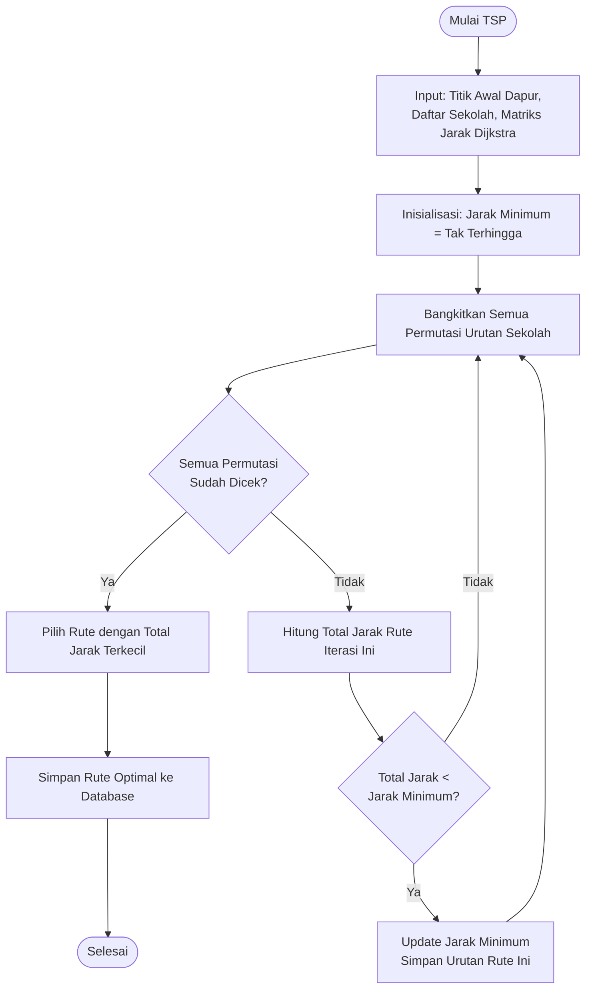

*Gambar 3.3 Flowchart Algoritma TSP*

---

## 3.7 Use Case Diagram

Berikut merupakan desain Use Case Diagram dari sistem yang dibangun:

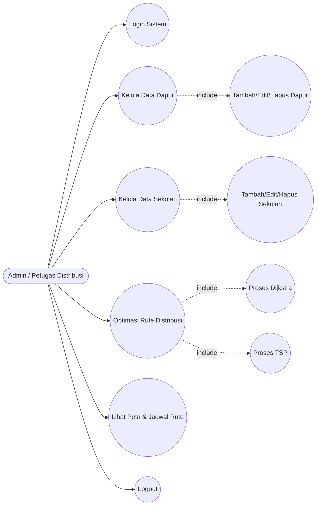

*Gambar 3.4 Use Case Diagram*

### Tabel 3.1 Deskripsi Aktor

| No | Aktor | Deskripsi |
|----|-------|-----------|
| 1  | Admin / Petugas Distribusi | Pengguna dengan hak akses penuh untuk mengelola data dan menjalankan optimasi rute distribusi MBG |

### Tabel 3.2 Deskripsi Use Case

| No | Nama Use Case | Deskripsi |
|----|---------------|-----------|
| 1  | Login Sistem | Proses autentikasi admin untuk masuk ke sistem |
| 2  | Kelola Data Dapur | Admin mengelola data dapur MBG (CRUD) |
| 3  | Kelola Data Sekolah | Admin mengelola data sekolah penerima MBG (CRUD) |
| 4  | Optimasi Rute Distribusi | Menjalankan proses hitung rute optimal dengan Dijkstra dan TSP |
| 5  | Proses Dijkstra | Sub-proses: menghitung jarak terpendek antar titik via jalan raya |
| 6  | Proses TSP | Sub-proses: menentukan urutan kunjungan paling efisien |
| 7  | Lihat Peta & Jadwal Rute | Menampilkan hasil rute optimal di peta interaktif dan tabel jadwal |
| 8  | Logout | Admin keluar dari sistem |

---

## 3.8 Use Case Scenario

### UC-01: Login Sistem

| Komponen | Keterangan |
|----------|------------|
| **Use Case Name** | Login Sistem |
| **ID** | UC-01 |
| **Priority** | High |
| **Actor** | Admin / Petugas Distribusi |
| **Description** | Use case ini menjelaskan proses autentikasi admin untuk masuk ke dalam sistem |
| **Trigger** | Admin ingin mengakses fitur sistem |
| **Preconditions** | Admin sudah memiliki akun; Sistem dalam keadaan online |
| **Normal Course** | 1. Admin mengakses halaman login<br>2. Sistem menampilkan form login<br>3. Admin menginputkan username dan password, lalu klik "Masuk"<br>4. Sistem memverifikasi kredensial ke database<br>5. Jika berhasil, sistem menampilkan Dashboard utama |
| **Postconditions** | Sesi admin aktif; Admin dapat mengakses seluruh fitur sistem |
| **Exceptions** | Jika kredensial salah, sistem menampilkan pesan "Login Gagal" dan admin diminta mencoba kembali |

### UC-02: Kelola Data Dapur

| Komponen | Keterangan |
|----------|------------|
| **Use Case Name** | Kelola Data Dapur |
| **ID** | UC-02 |
| **Priority** | High |
| **Actor** | Admin |
| **Description** | Admin menambah, mengedit, atau menghapus data Dapur MBG |
| **Trigger** | Admin ingin memperbarui data titik dapur |
| **Preconditions** | Admin sudah login; Sistem dalam keadaan online |
| **Normal Course** | 1. Admin memilih menu "Data Dapur"<br>2. Sistem menampilkan daftar dapur yang ada<br>3. Admin memilih aksi: Tambah / Edit / Hapus<br>4. Sistem memproses perubahan dan menyimpan ke database<br>5. Sistem menampilkan notifikasi berhasil |
| **Postconditions** | Data dapur berhasil diperbarui di database |
| **Exceptions** | Jika validasi gagal, sistem menampilkan pesan error dan admin diminta melengkapi data |

### UC-03: Optimasi Rute Distribusi

| Komponen | Keterangan |
|----------|------------|
| **Use Case Name** | Optimasi Rute Distribusi |
| **ID** | UC-03 |
| **Priority** | High |
| **Actor** | Admin |
| **Description** | Admin menjalankan proses optimasi rute untuk mendapatkan jalur distribusi MBG yang paling efisien |
| **Trigger** | Admin ingin mengetahui rute distribusi terbaik |
| **Preconditions** | Admin sudah login; Data dapur dan sekolah sudah ada di database |
| **Normal Course** | 1. Admin memilih menu "Optimasi Rute"<br>2. Admin memilih Dapur asal dan sekolah-sekolah tujuan<br>3. Admin menekan tombol "Hitung Rute Terbaik"<br>4. Sistem mengunduh graf jalan (OSMnx)<br>5. Sistem menghitung matriks jarak via Algoritma Dijkstra<br>6. Sistem menentukan urutan kunjungan via Algoritma TSP<br>7. Sistem menampilkan peta rute dan tabel jadwal |
| **Postconditions** | Rute optimal ditampilkan; Hasil disimpan ke tabel rute_distribusi |
| **Exceptions** | Jika koneksi jaringan gagal saat mengunduh peta, sistem menampilkan pesan error |

---

## 3.9 Activity Diagram

### 3.9.1 Activity Diagram Login

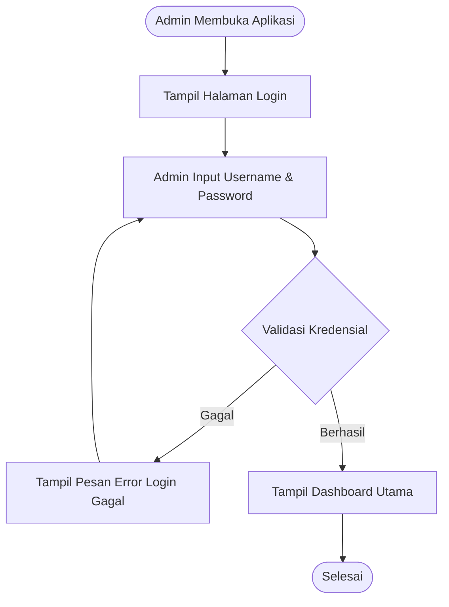

*Gambar 3.5 Activity Diagram Login*

### 3.9.2 Activity Diagram Kelola Data Dapur & Sekolah

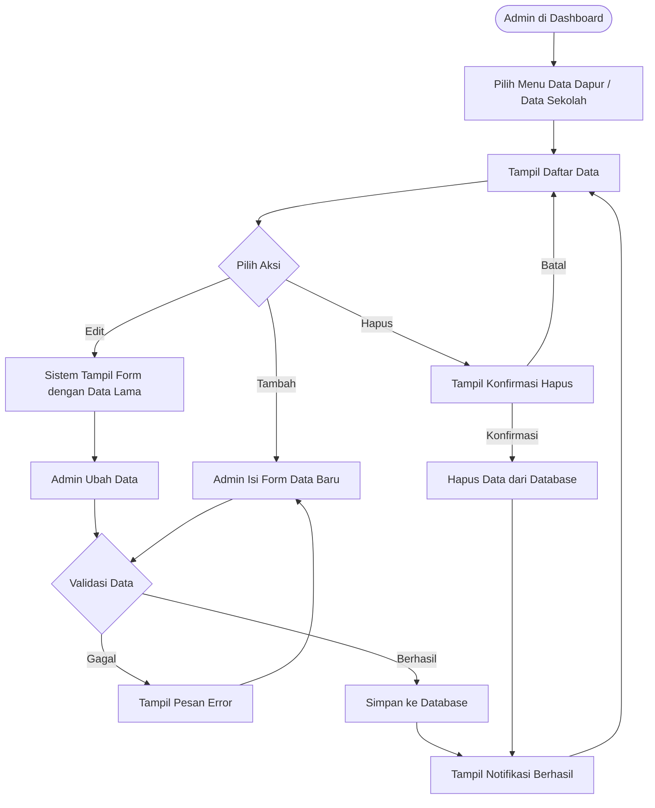

*Gambar 3.6 Activity Diagram Kelola Data*

### 3.9.3 Activity Diagram Optimasi Rute Distribusi

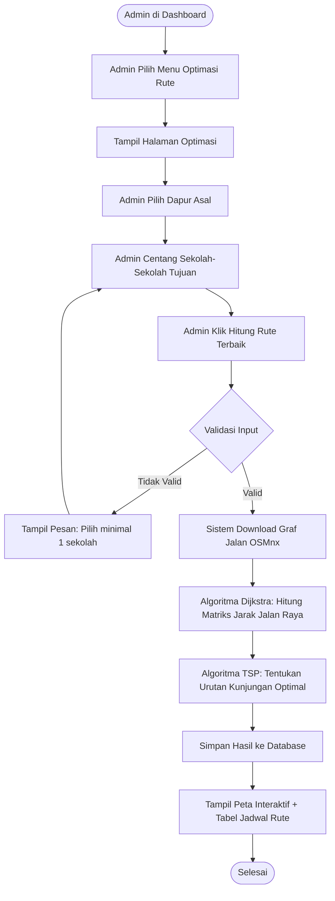

*Gambar 3.7 Activity Diagram Optimasi Rute Distribusi*

### 3.9.4 Activity Diagram Logout

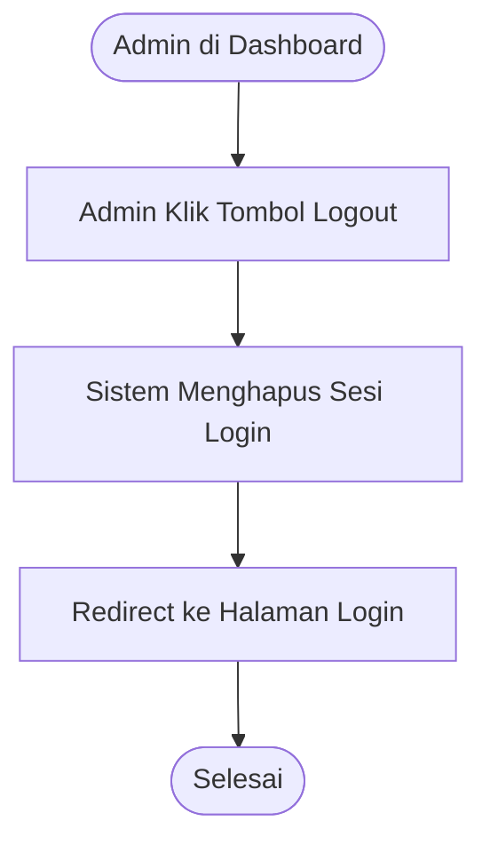

*Gambar 3.8 Activity Diagram Logout*

---

## 3.10 Sequence Diagram

### 3.10.1 Sequence Diagram Login

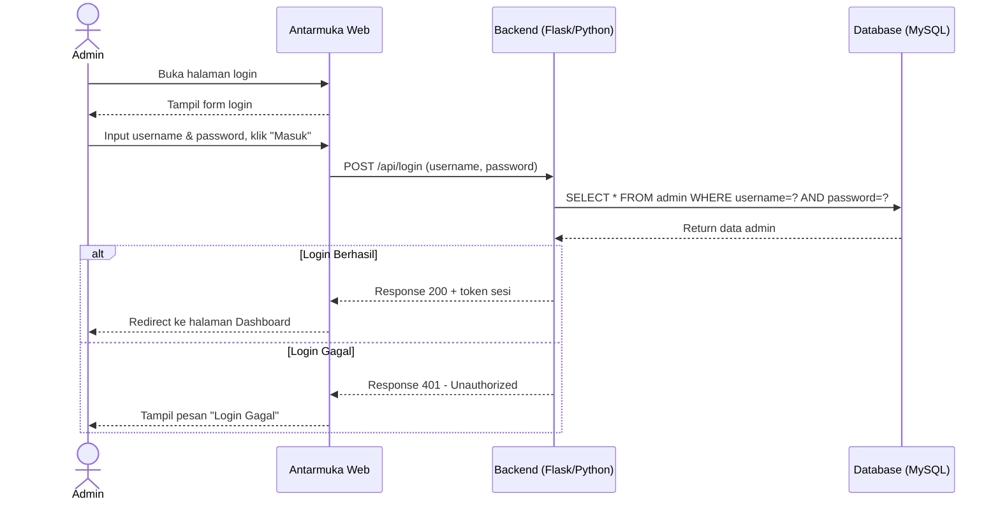

*Gambar 3.9 Sequence Diagram Login*

### 3.10.2 Sequence Diagram Optimasi Rute Distribusi

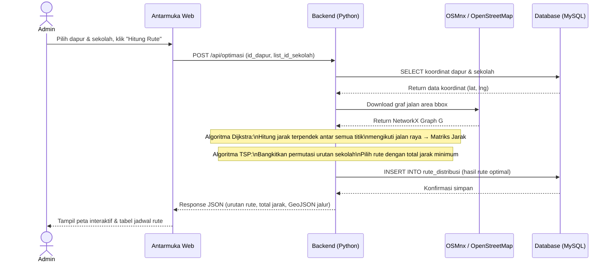

*Gambar 3.10 Sequence Diagram Optimasi Rute Distribusi*

### 3.10.3 Sequence Diagram Kelola Data (Tambah Dapur)

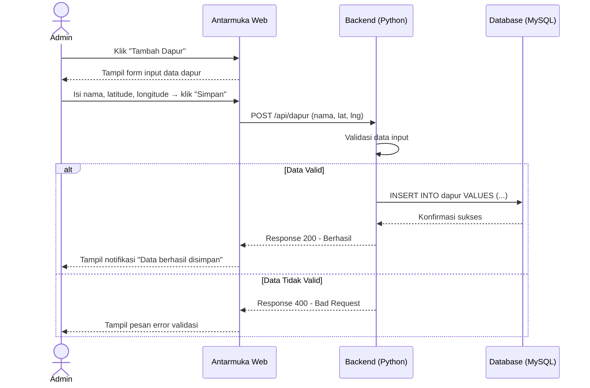

*Gambar 3.11 Sequence Diagram Tambah Dapur*

### 3.10.4 Sequence Diagram Logout

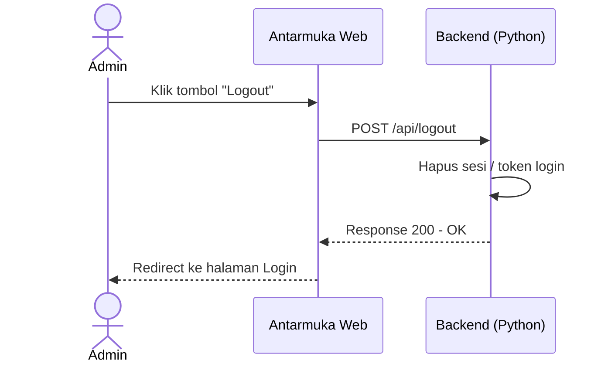

*Gambar 3.12 Sequence Diagram Logout*

---

## 3.11 Class Diagram

Class Diagram menggambarkan struktur kelas-kelas dalam sistem dan hubungan antar kelas.

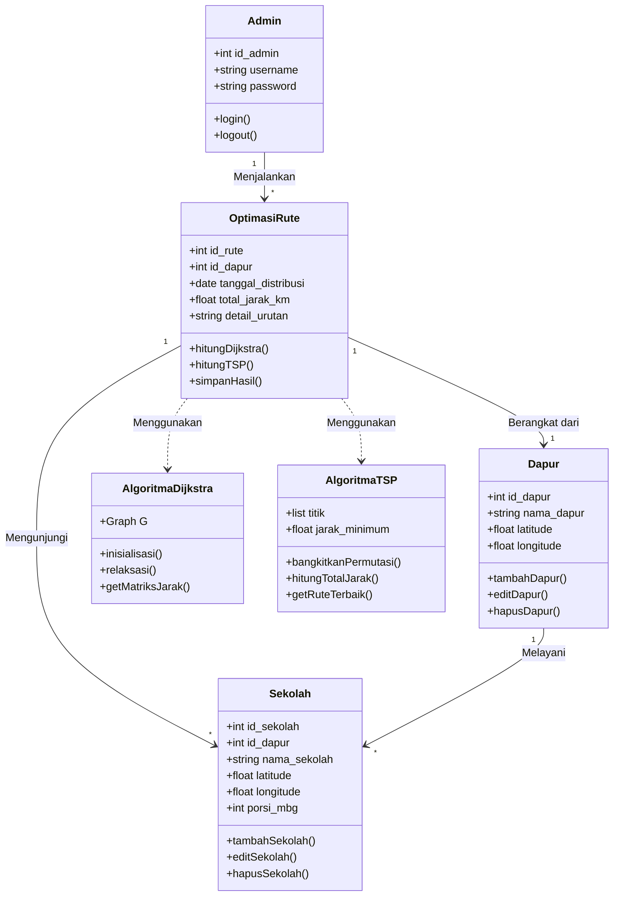

*Gambar 3.13 Class Diagram*

---

## 3.12 Entity Relationship Diagram (ERD)

ERD menggambarkan hubungan antar entitas di dalam basis data sistem.

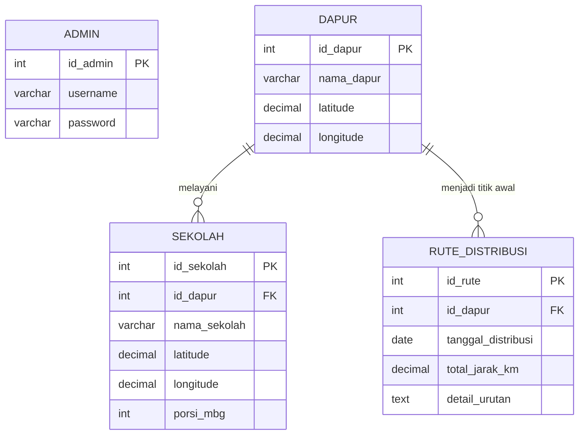

*Gambar 3.14 Entity Relationship Diagram (ERD)*

---

## 3.13 Wireframe Antarmuka

### 3.13.1 Wireframe Halaman Login

Halaman login menampilkan:
- Logo/Judul Sistem di bagian atas
- Form input **Username**
- Form input **Password**
- Tombol **"Masuk"**

*Gambar 3.15 Wireframe Halaman Login*

---

### 3.13.2 Wireframe Dashboard Utama

Dashboard utama terdiri dari:
- **Sidebar Kiri**: Menu navigasi (Dashboard, Data Dapur, Data Sekolah, Optimasi Rute, Riwayat, Logout)
- **Header**: Judul "Sistem Distribusi MBG" + info admin yang login
- **Konten Utama**: Statistik ringkas (total dapur, total sekolah, total porsi MBG) dalam bentuk card

*Gambar 3.16 Wireframe Halaman Dashboard*

---

### 3.13.3 Wireframe Halaman Optimasi Rute

Halaman optimasi terdiri dari:
- **Panel Kiri**:
  - Dropdown pilih Dapur asal
  - Daftar checkbox sekolah-sekolah tujuan
  - Tombol **"Hitung Rute Terbaik"**
- **Panel Kanan**:
  - Peta interaktif (Leaflet.js) menampilkan marker dapur & sekolah
  - Setelah proses: garis rute (*polyline*) ditampilkan di peta
- **Panel Bawah**:
  - Tabel urutan kunjungan hasil TSP (No, Nama Sekolah, Jarak)
  - Total jarak tempuh

*Gambar 3.17 Wireframe Halaman Optimasi Rute*

---

### 3.13.4 Wireframe Halaman Data Dapur / Sekolah

Halaman kelola data terdiri dari:
- **Tabel data** yang menampilkan daftar semua dapur/sekolah beserta kolom aksi (Edit, Hapus)
- **Tombol "Tambah Data"** di atas tabel
- **Modal/Form** yang muncul saat tombol Tambah atau Edit diklik, berisi field: Nama, Latitude, Longitude (dan Porsi MBG untuk sekolah)

*Gambar 3.18 Wireframe Halaman Kelola Data*

---

*Dokumen BAB III ini dapat diekspor ke Microsoft Word. Untuk diagram Mermaid, gunakan [mermaid.live](https://mermaid.live) untuk merender menjadi gambar.*
