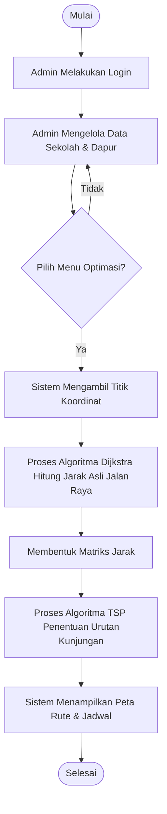
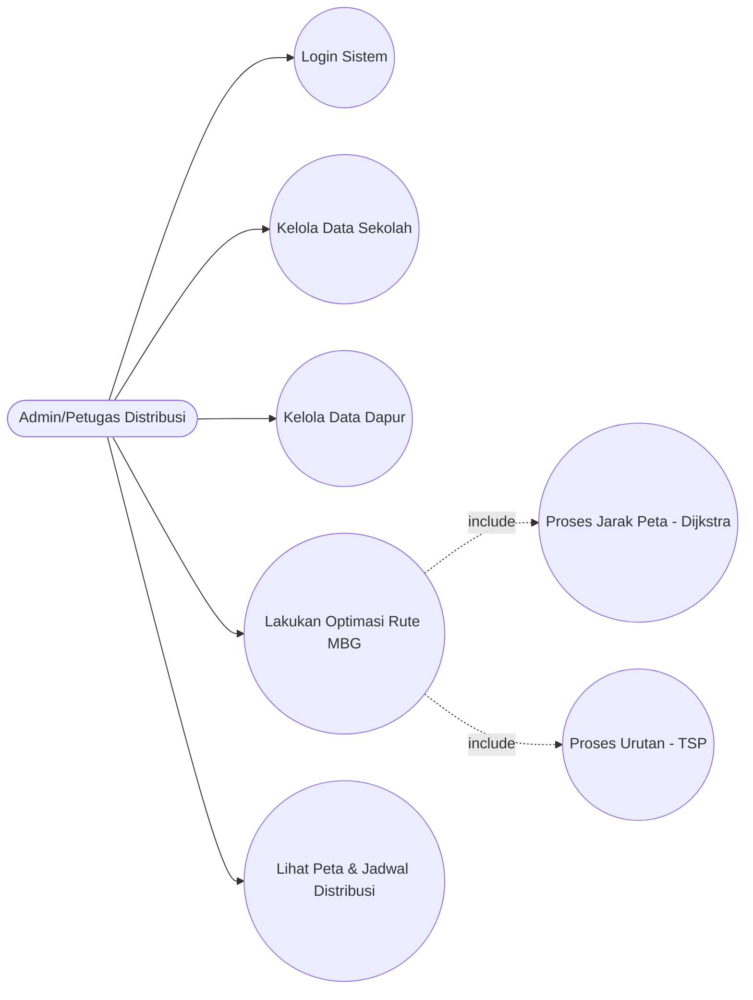
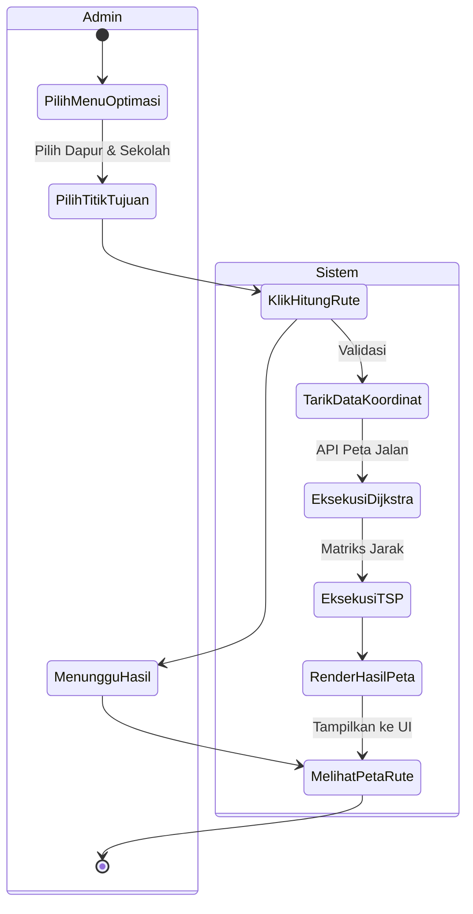
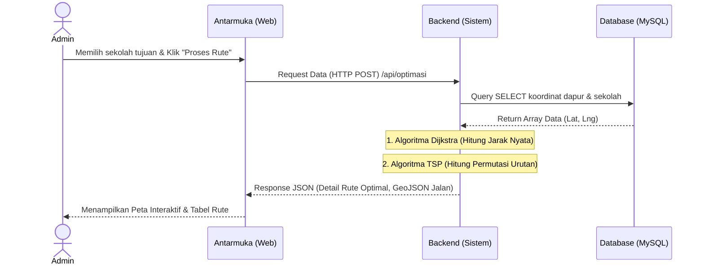
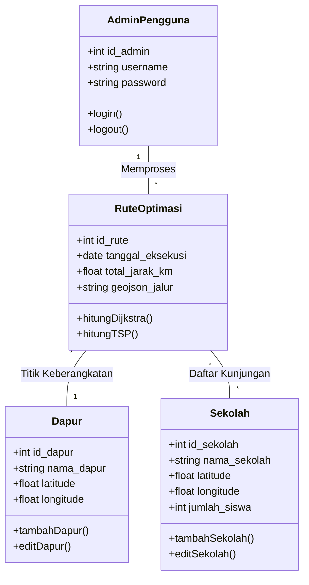
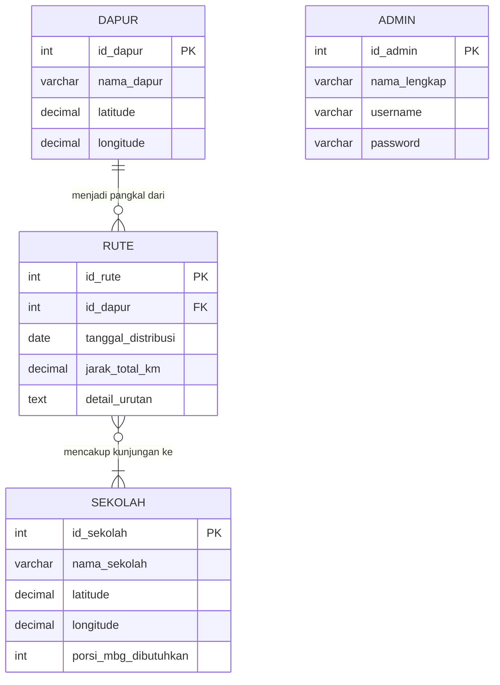

# DOKUMEN TAMBAHAN BAB 2 & BAB 3 (UNTUK PRESENTASI UTS)

Dokumen ini berisi materi yang siap Anda *copy-paste* ke dalam dokumen laporan atau *slide* presentasi UTS Anda. Semua diagram telah digenerate menggunakan format yang bisa divisualisasikan.

---

# BAB II: LANDASAN TEORI (Tambahan)

## 2.x Bahasa Pemrograman
Dalam pengembangan Sistem Penjadwalan dan Rute Distribusi Makanan Bergizi Gratis (MBG) ini, digunakan beberapa bahasa pemrograman:
1.  **Python**: Digunakan sebagai bahasa utama pada sisi *backend*. Python dipilih karena memiliki ekosistem *library* yang sangat kuat untuk pemrosesan algoritma matematis dan graf, seperti `NetworkX` dan `OSMnx` yang sangat vital untuk memproses algoritma Dijkstra dan Travelling Salesman Problem (TSP).
2.  **JavaScript, HTML, dan CSS**: Digunakan pada sisi *frontend* (antarmuka pengguna) untuk membangun visualisasi sistem berbasis web. JavaScript digunakan bersama *library* pemetaan seperti `Leaflet.js` untuk merender peta jalan interaktif dan menampilkan rute distribusi secara visual kepada pengguna.

## 2.y Database MySQL
**MySQL** adalah sistem manajemen basis data relasional (RDBMS) berbasis SQL (*Structured Query Language*). Pada sistem ini, MySQL berfungsi sebagai media penyimpanan data utama yang mencakup titik kordinat letak dapur pusat, letak sekolah penerima MBG, hingga menyimpan hasil rekaman rute distribusi terbaik yang telah dihitung oleh algoritma. Kehandalan MySQL dalam menangani relasi data membuatnya cocok untuk sistem inventori dan distribusi.

## 2.z Unified Modeling Language (UML) dan Flowchart
Untuk merancang arsitektur sistem, digunakan pendekatan perancangan terstruktur dengan:
1.  **Flowchart (Bagan Alir)**: Representasi grafis dari langkah-langkah dan urutan logika suatu proses (sistem maupun algoritma spesifik).
2.  **Use Case Diagram**: Diagram UML yang menggambarkan interaksi antara aktor (pengguna) dengan sistem.
3.  **Activity Diagram**: Diagram UML yang memodelkan alur kerja (*workflow*) atau aktivitas sistem dari awal hingga akhir.
4.  **Sequence Diagram**: Diagram UML yang menampilkan interaksi antar objek atau komponen dalam sistem berdasarkan urutan waktu.
5.  **Class Diagram**: Diagram UML yang menunjukkan struktur kelas-kelas dalam sistem dan hubungan (*relationship*) antar kelas tersebut.
6.  **Entity Relationship Diagram (ERD)**: Model data konseptual yang menggambarkan hubungan antar entitas (tabel) di dalam basis data.

---

# BAB III: PERANCANGAN SISTEM

## 3.1 Flowchart Sistem Utama
Flowchart ini menggambarkan alur kerja sistem secara keseluruhan dari sudut pandang pengguna.



## 3.2 Flowchart Algoritma
Karena terdapat dua algoritma yang digunakan, maka flowchart algoritma dibagi menjadi dua bagian.

### A. Flowchart Algoritma Dijkstra
Berfungsi untuk mencari jarak tempuh terpendek antar dua titik mengikuti graf jalan raya (bukan jarak lurus).

```mermaid
graph TD
    Start([Mulai Dijkstra]) --> Inisialisasi[Inisialisasi jarak semua node = Tak Terhingga (Inf), <br/> Jarak Node Awal = 0]
    Inisialisasi --> Queue[Masukkan semua node ke dalam antrean antrean prioritas]
    Queue --> CekQueue{Antrean Kosong?}
    CekQueue -- Ya --> SelesaiD([Selesai: Jarak Terpendek Ditemukan])
    CekQueue -- Tidak --> EkstrakMin[Ambil node U dengan jarak minimum dari antrean]
    EkstrakMin --> IterasiTetangga[Ambil semua tetangga V dari node U]
    IterasiTetangga --> Relax{"Jarak U + Bobot(U,V) < Jarak V?"}
    Relax -- Ya --> UpdateV[Update Jarak V = Jarak U + Bobot(U,V)]
    UpdateV --> IterasiTetangga
    Relax -- Tidak --> IterasiTetangga
    IterasiTetangga -.->|Setelah semua tetangga U dicek| CekQueue
```

### B. Flowchart Algoritma TSP (Travelling Salesman Problem)
Berfungsi untuk menentukan urutan kunjungan ke beberapa sekolah agar total jarak yang ditempuh kurir adalah yang paling minimum, kemudian kurir kembali ke titik awal.

```mermaid
graph TD
    Start([Mulai TSP]) --> InputTSP[Input: Titik Awal (Dapur), Daftar Sekolah, <br/> Matriks Jarak Hasil Dijkstra]
    InputTSP --> Permutasi[Bangkitkan Permutasi Kemungkinan Urutan Rute]
    Permutasi --> CekPermutasi{Semua Kombinasi Dicek?}
    CekPermutasi -- Ya --> OutputTSP[Pilih dan Simpan Rute dengan Total Jarak Terkecil]
    OutputTSP --> End([Selesai])
    CekPermutasi -- Tidak --> HitungRute[Hitung Total Jarak Rute Iterasi Saat Ini]
    HitungRute --> Bandingkan{"Total Jarak < Jarak Minimum Tersimpan?"}
    Bandingkan -- Ya --> UpdateMin[Update Jarak Minimum = Total Jarak <br/> Simpan Urutan Rute Ini]
    Bandingkan -- Tidak --> Permutasi
    UpdateMin --> Permutasi
```

## 3.3 Use Case Diagram
Menjelaskan apa saja yang bisa dilakukan oleh pengguna di dalam sistem.



## 3.4 Use Case Scenario
Skenario untuk *Use Case* Utama: **Lakukan Optimasi Rute MBG**.

| Komponen | Keterangan |
| :--- | :--- |
| **Nama Use Case** | Lakukan Optimasi Rute MBG |
| **Aktor Utama** | Admin / Petugas Distribusi |
| **Kondisi Awal** | Admin sudah login dan berada di halaman *Dashboard* atau menu Optimasi. Data dapur dan sekolah minimal ada 2 titik. |
| **Skenario Normal** | 1. Admin memilih menu "Optimasi Rute".<br>2. Admin memilih titik keberangkatan (Dapur Pusat).<br>3. Admin mencentang sekolah-sekolah yang akan dikunjungi.<br>4. Admin menekan tombol "Hitung Rute Terbaik".<br>5. Sistem memproses Dijkstra dan TSP.<br>6. Sistem menampilkan hasil berupa peta bergaris (*polyline*) dan urutan daftar. |
| **Kondisi Akhir** | Sistem berhasil menyimpan log perhitungan dan menampilkan rute di layar layar kepada Admin. |

## 3.5 Activity Diagram
Alur aktivitas antara Admin dengan Sistem ketika melakukan penentuan rute.



## 3.6 Sequence Diagram
Menjelaskan urutan proses eksekusi antar objek dari UI sampai ke Database saat perhitungan rute.



## 3.7 Class Diagram (Nilai Plus)
Rancangan kelas jika program diimplementasikan dengan paradigma *Object-Oriented Programming (OOP)*.



## 3.8 Entity Relationship Diagram (ERD)
Rancangan relasi antar entitas yang ada di tabel *database* MySQL.



## 3.9 Desain Antarmuka (UI Wireframe)

Untuk desain Wireframe / Antarmuka, berikut adalah deskripsi layout struktural yang dapat Anda rancang di Figma untuk dilampirkan:

1.  **Wireframe Login Page**
    *   **Tengah Layar**: Kotak putih berisi Logo MBG, kolom input "Username", kolom input "Password", dan tombol "Masuk". Background berupa gambar peta samar.

2.  **Wireframe Dashboard Utama (Menu Optimasi)**
    *   **Sidebar Kiri**: Menu Navigasi (Dashboard, Data Dapur, Data Sekolah, Riwayat Rute, Keluar).
    *   **Bagian Atas Kanan (Header)**: Tulisan "Sistem Rute Distribusi MBG", Profil Admin.
    *   **Area Konten (Kiri)**: Daftar *checkbox* data sekolah, dropdown untuk memilih Dapur Pusat pemberangkatan, dan tombol besar **"Mulai Hitung Rute Optimal"**.
    *   **Area Konten (Kanan)**: Kotak Peta (Map placeholder) untuk menampilkan titik (*marker*) sekolah yang dicentang.

3.  **Wireframe Hasil Output Rute**
    *   Masih di halaman yang sama, namun setelah tombol ditekan.
    *   **Area Peta**: Peta sekarang menampilkan garis rute (*polyline*) menyambungkan titik-titik sekolah secara berurutan.
    *   **Area Bawah Peta**: Menampilkan Kotak Kesimpulan (Misal: "Total Jarak: 15.4 KM", "Estimasi Waktu: 45 Menit").
    *   **Area Kiri (Tabel)**: Daftar sekolah berubah menjadi tabel dengan nomor urut kunjungan 1, 2, 3, dst hasil dari algoritma TSP. Disediakan tombol "Cetak Jadwal PDF".

---
*(Dokumen ini bisa Anda salin seluruhnya dan paste ke dalam laporan Microsoft Word. Untuk diagram yang menggunakan kode "mermaid", Anda bisa mem-paste kodenya ke *tools online* seperti **mermaid.live** untuk merender kodenya menjadi gambar yang bisa didownload dan ditaruh di laporan Anda/Presentasi Anda).*
